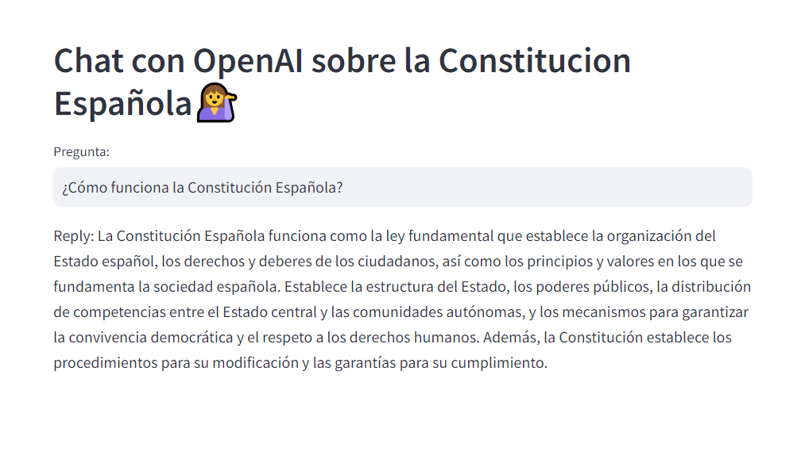

# Preguntas y Respuestas sobre la Constitución Española con OpenAI y LangChain

Este proyecto implementa un sistema de **preguntas y respuestas** (Q&A) sobre la **Constitución Española** utilizando un enfoque de **Retrieval-Augmented Generation (RAG)**, mediante la base de datos **ChromaDB** y **OpenAI**. El sistema permite realizar preguntas sobre los artículos y funcionamiento de la Constitución Española, proporcionando respuestas basadas en el contenido de este documento.

Este proyecto permite realizar preguntas sobre la **Constitución Española** y generar respuestas basadas en los artículos relevantes utilizando **ChromaDB** y **OpenAI**.

## Importante: Variables de Entorno

Antes de ejecutar la aplicación, es **esencial** crear un archivo `.env` en la raíz del proyecto que contenga tus claves de API de OpenAI. Mis claves están ocultas por razones de seguridad, por lo que necesitarás tus propias claves para que la aplicación funcione.

El archivo .env debe tener el siguiente formato:
OPENAI_API_KEY=tu-clave-openai
LANGCHAIN_API_KEY=tu-clave-langchain


### ¿Cómo funciona?
1. **Ingesta de datos**: El script `create_database.py` carga el texto completo de la Constitución Española desde un archivo PDF, lo divide en fragmentos más pequeños (chunks) y crea embeddings utilizando **OpenAI**.
2. **Base de datos de embeddings**: Los fragmentos se almacenan en **ChromaDB**, una base de datos vectorial optimizada para realizar búsquedas semánticas eficientes.
3. **Aplicación de preguntas**: El script `app.py` permite hacer preguntas sobre la Constitución Española. Utiliza un **prompt template** personalizado para garantizar que las respuestas sean claras y estén basadas en el contexto relevante.

## Ejemplos de preguntas

Puedes hacer preguntas como:
- ¿Qué dice el artículo 50?
- ¿Cómo funciona la Constitución Española?
- ¿Qué derechos reconoce la Constitución?

## Capturas de Pantalla

A continuación, se muestran ejemplos de cómo funciona la aplicación:


*Figura 1: Interfaz de la aplicación donde se introducen las preguntas.*

## Estructura del proyecto

Este repositorio contiene dos scripts principales:

### 1. `create_database.py`
Este script se encarga de crear la base de datos de embeddings a partir del contenido de la Constitución Española.

#### Pasos:
- Carga el PDF de la Constitución.
- Divide el documento en fragmentos utilizando `RecursiveCharacterTextSplitter` de **LangChain**.
- Genera embeddings para cada fragmento utilizando `OpenAIEmbeddings`.
- Guarda los embeddings en **ChromaDB** para su posterior consulta.

#### Uso:
Para ejecutar el script y crear la base de datos, utiliza el siguiente comando en la terminal:

```bash
python create_database.py

### 2. `app.py`

El script `app.py` es la aplicación principal que permite hacer preguntas sobre la Constitución Española. Utiliza una combinación de recuperación de fragmentos de texto relevantes (RAG - Retrieval-Augmented Generation) y generación de respuestas utilizando la API de OpenAI y LangChain.
Para poder correr la aplicación:

El script `app.py` es la aplicación principal que permite hacer preguntas sobre la Constitución Española. Utiliza una combinación de recuperación de fragmentos de texto relevantes (RAG - Retrieval-Augmented Generation) y generación de respuestas utilizando la API de OpenAI y LangChain.

#### Características:

- **Interfaz de Texto**: Recibe la pregunta del usuario a través de una interfaz de texto.
- **Búsqueda Semántica**: Busca fragmentos relevantes en **ChromaDB** utilizando los embeddings de OpenAI.
- **Respuesta Contextual**: Genera una respuesta utilizando un **prompt template** que garantiza que la respuesta esté basada en el contexto de los fragmentos recuperados.

```bash
streamlit run app.py
